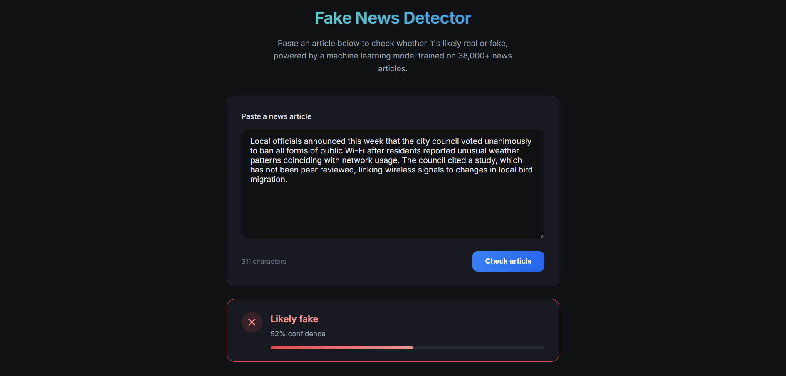

# Fake News Detector

A machine learning system that classifies news articles as real or fake, built end-to-end from raw data through a deployed web application. The project deliberately surfaces and fixes real dataset leakage rather than reporting inflated benchmark numbers.

## Demo



## Problem

Given the text of a news article, predict whether it's likely real or fabricated. This project compares five modeling approaches — from classical ML to a fine-tuned transformer — and ships the most practical one behind a real API and UI.

## Dataset & Data Quality

Built on the public Fake and Real News dataset (~44,900 articles, roughly balanced between classes).

**Two leakage issues were found and fixed during EDA, not left in:**

- **`subject` column leak**: fake and real articles came from entirely disjoint subject categories (zero overlap), meaning a model could hit near-100% accuracy just by memorizing the collection source rather than learning to detect fake news. Dropped before modeling.
- **Reuters dateline leak**: 99.2% of real articles began with a wire-service dateline (e.g. `WASHINGTON (Reuters) -`) versus 0.04% of fake articles. This is a scraping artifact, not a genuine signal, and was stripped via regex before training.

After cleanup, near-empty rows (<10 words) were also removed, leaving 38,483 clean articles. All modeling uses `text` only (not `title`), a deliberate choice to avoid the model leaning on tabloid-style headline patterns and to match a realistic deployment input (a pasted article body).

## Model Comparison

Five models were trained and evaluated on an identical held-out test set:

| Model                       | Accuracy | Precision | Recall | F1         |
| --------------------------- | -------- | --------- | ------ | ---------- |
| **DistilBERT (fine-tuned)** | 99.79%   | 99.66%    | 99.95% | **99.81%** |
| SVM (LinearSVC)             | 98.70%   | 98.39%    | 99.27% | 98.83%     |
| XGBoost                     | 98.58%   | 98.22%    | 99.22% | 98.72%     |
| Logistic Regression         | 98.35%   | 97.88%    | 99.15% | 98.51%     |
| Naive Bayes                 | 94.50%   | 94.47%    | 95.61% | 95.04%     |

**DistilBERT achieves the best raw accuracy**, capturing contextual and semantic patterns that TF-IDF bag-of-words features can't. However, **the deployed API serves the SVM model** — it trains in seconds, runs inference in milliseconds on CPU, and requires no GPU or heavy model files, a deliberate accuracy-vs-latency/deployment-cost tradeoff rather than a default choice of "whatever scored highest."

## Architecture

```
React frontend  →  FastAPI backend  →  TF-IDF vectorizer  →  SVM classifier
                         ↓
                  reuses the same text-cleaning
                  pipeline used at training time
```

The backend calls the exact same `preprocess()` function from training at inference time, avoiding train/serve skew — a common real-world bug where cleaning logic silently diverges between notebook and production.

## Tech Stack

- **ML/DL**: scikit-learn, XGBoost, Hugging Face Transformers (DistilBERT), PyTorch
- **Backend**: FastAPI, Pydantic
- **Frontend**: React
- **Testing**: pytest (text cleaning, API endpoints)
- **Tooling**: Jupyter, joblib, NLTK

## Project Structure

```
fake-news-detector/
├── data/               # raw + processed datasets
├── notebooks/          # EDA → cleaning → modeling → comparison, in order
├── src/                # reusable cleaning/loading/eval logic
├── tests/              # pytest suite
├── models/             # trained models, vectorizer, results
├── backend/            # FastAPI app
├── frontend/           # React app
```

## Running Locally

**Backend:**

```bash
pip install -r requirements.txt
uvicorn backend.main:app --reload --port 8000
```

**Frontend:**

```bash
cd frontend
npm install
npm start
```

Visit `http://localhost:3000`, paste an article, and check the result.

## Key Learnings

- Dataset leakage can hide behind innocuous-looking columns (`subject`) and boilerplate text (wire-service datelines) — high accuracy alone doesn't mean a model actually learned the task.
- The best model isn't always the one you deploy; latency, cost, and simplicity are real constraints in production decisions.
- Keeping preprocessing logic in one shared module (not duplicated between notebook and API) prevents an entire category of silent bugs.

## What's Next

- Add SHAP/coefficient-based explainability to show which words drove a prediction
- Expand training data beyond a single dataset's writing style/time period
- Add a confidence calibration step (SVM's decision_function-based confidence is a proxy, not a true probability)
